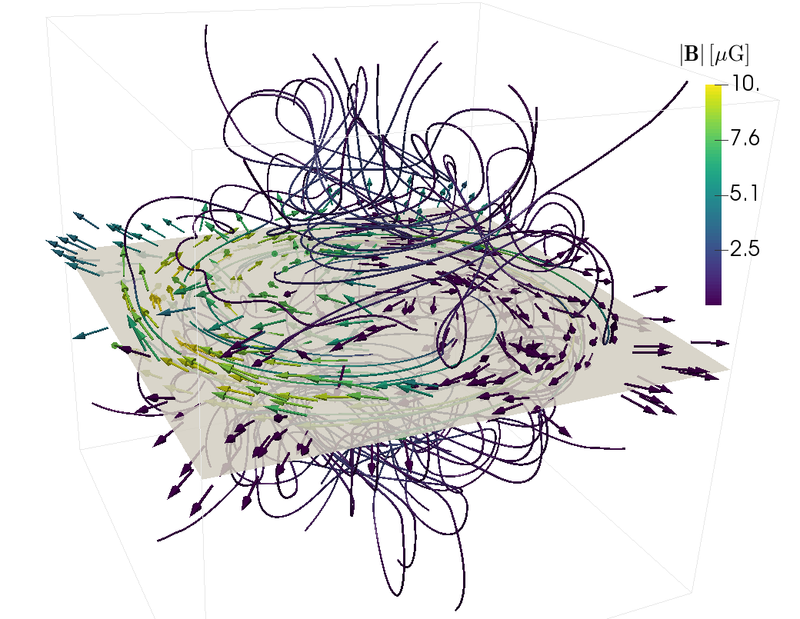

.. GalMag documentation master file, created by
   sphinx-quickstart on Wed Nov 22 17:31:31 2017.
   You can adapt this file completely to your liking, but it should at least
   contain the root `toctree` directive.

GalMag Documentation
==================================

<<<<<<< HEAD

This is the documentation of `GalMag <https://github.com/luizfelippesr/galmag>`_, 
a `Python <http://www.python.org>`_  package for computing galactic magnetic fields 
based on mean field dynamo theory.

For a detailed description of the physics, please refer to the code 
`paper <https://ui.adsabs.harvard.edu/abs/2019A&A...623A.113S/abstract>`_.

.. toctree::
    :maxdepth: 2
    :caption: Tutorial:

    galmag_tutorial

.. toctree::
    :maxdepth: 3
    :caption: API Reference

    modules

* :ref:`genindex`
* :ref:`modindex`
* :ref:`search`
